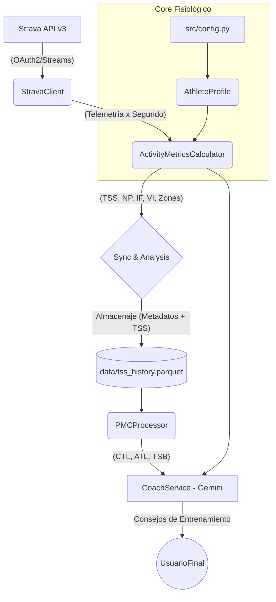

# Arquitectura del Performance Metrics Engine

Este documento detalla el flujo de datos y la organización lógica de los componentes que conforman el motor de análisis de rendimiento deportivo.

## 🏁 Flujo de Datos General

El motor opera en capas (Data, Logic, Insights) para transformar telemetría bruta de GPS en consejos accionables de entrenamiento.

## 🏗️ Capas del Sistema

### 1. Ingestión (Data Layer)
- **`StravaClient`**: Orquestador de la comunicación con Strava. Maneja la autenticación, descarga de listas de actividades y el "peso" (telemetría segundo a segundo).

### 2. Procesamiento (Logic Layer)
- **`AthleteProfile`**: Centraliza el estado físico del deportista (FTP, Pulsaciones, Peso). Genera automáticamente las zonas de entrenamiento (7 zonas Coggan para potencia y 7 zonas Friel para HR).
- **`ActivityMetricsCalculator`**: Es el motor matemático. Implementa algoritmos de suavizado (NP) y cálculos de estrés (TSS, hrTSS).
- **`PMCProcessor`**: El cerebro temporal. Calcula promedios móviles exponenciales de 42 días (Fitness) y 7 días (Fatiga).

### 3. Inteligencia (Insight Layer)
- **`GeminiCoach`**: Puerta de enlace con el LLM de Google.
- **`CLI (main.py)`**: Permite consultar cualquier actividad rápidamente desde la terminal.
- **`Status (status.py)`**: Dashboard rápido en terminal con el impacto de la última semana.

## 📊 Features Principales Implementadas
1. **hrTSS Inteligente:** Cálculo de carga basado en pulso cuando no hay potenciómetro.
2. **Potencia Normalizada (NP):** Cálculo exacto de la carga real suavizando picos de inercia.
3. **Persistencia Local:** Sincronización histórica cacheada en CSV para optimizar llamadas a la API.
4. **Resumen en Zonas:** Desglose detallado del tiempo de permanencia en cada zona fisiológica.
